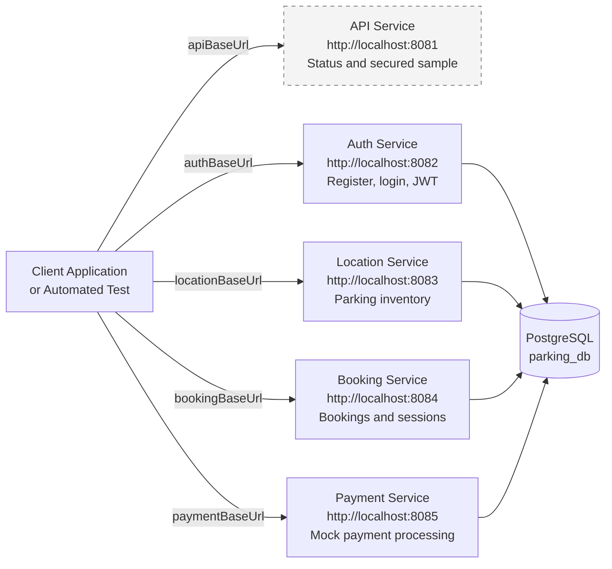
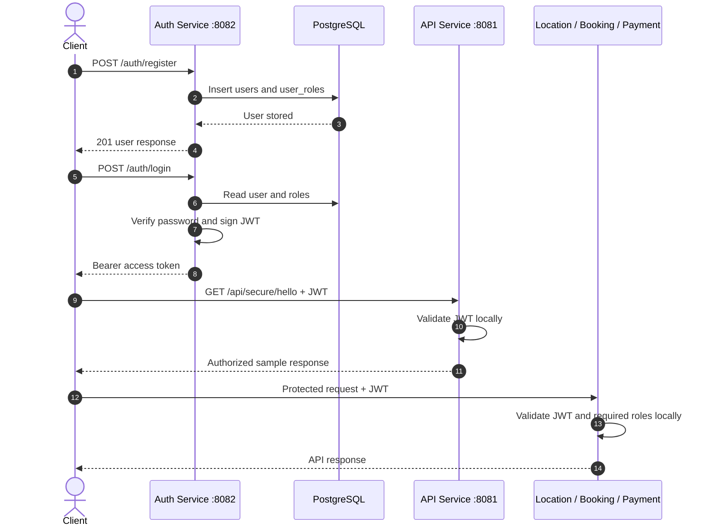
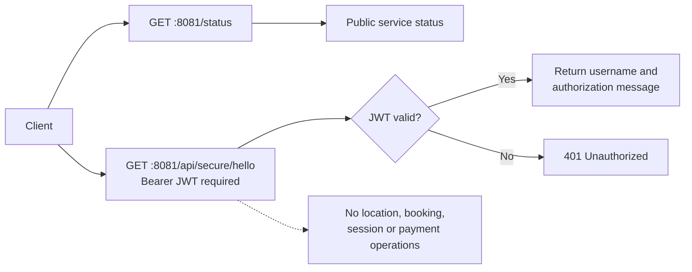
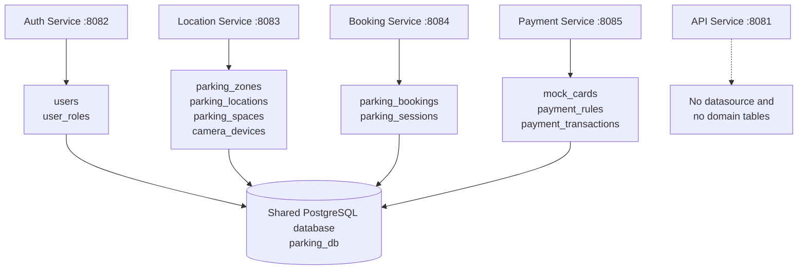
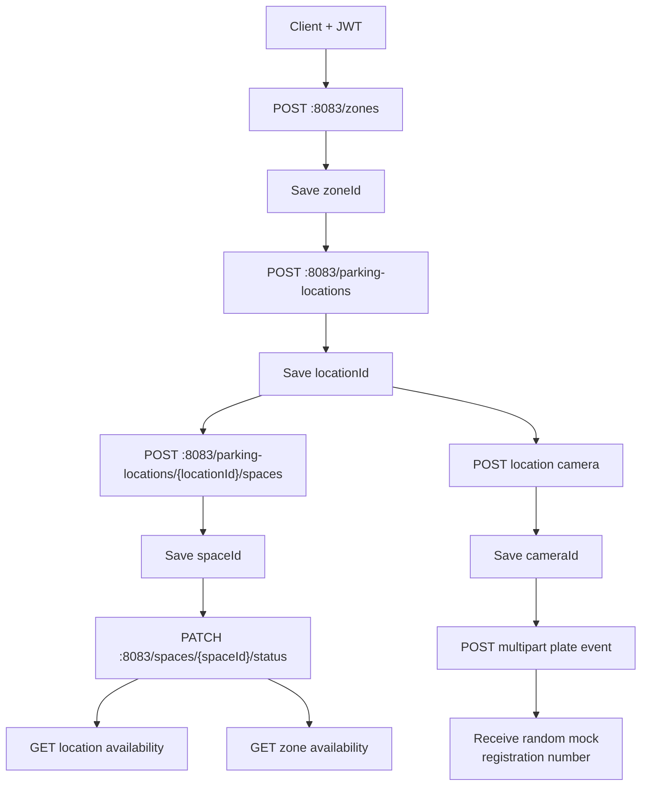
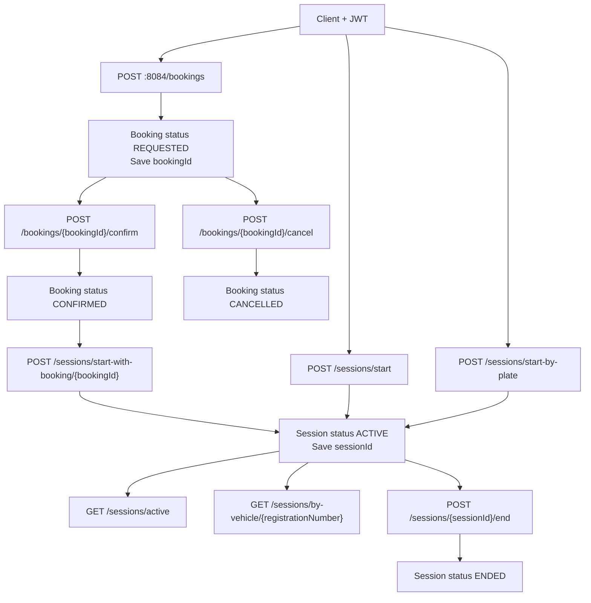
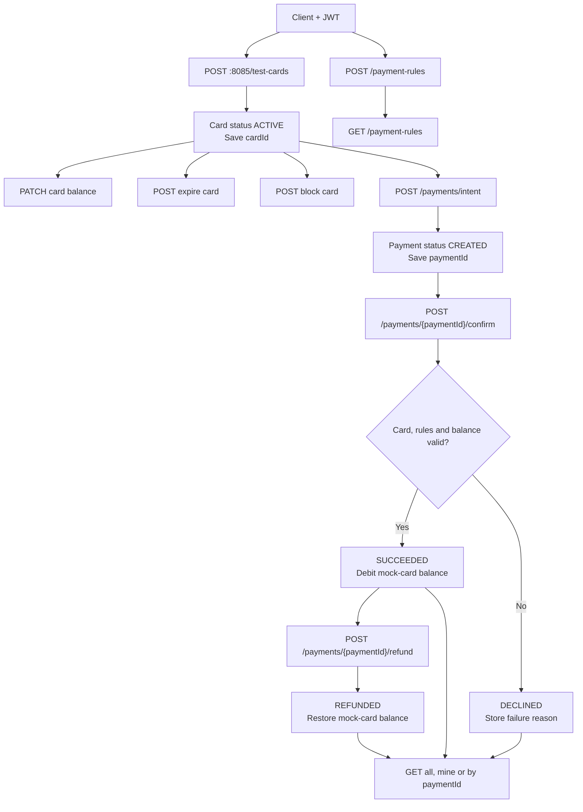
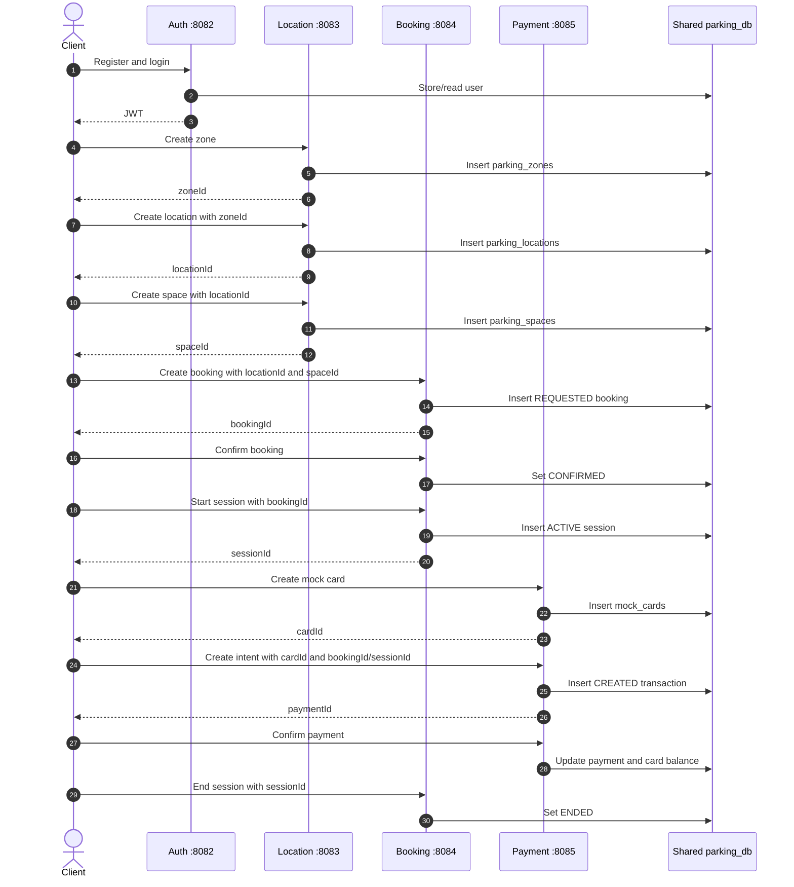
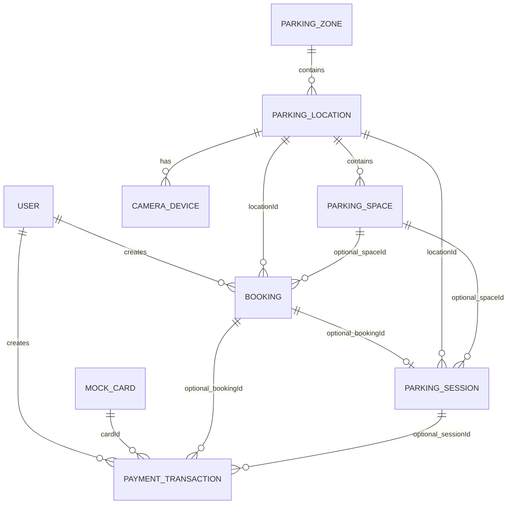
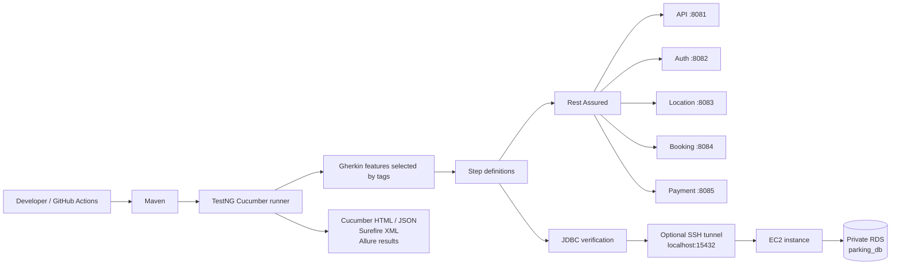

# Parking Services Architecture

This document explains the implemented Parking Platform microservices, their responsibilities, data ownership, security model, and business workflows. It is intended to help the testing team understand what must be tested independently and across services.

## 1. Microservices Overview

The platform contains **five directly accessible microservices**. Auth, Location, Booking, and Payment form the core parking workflow. The API service is a small independent service used to demonstrate public and JWT-protected endpoints.

## 2. Authentication and Direct JWT Use

The client sends the token directly to protected APIs using `Authorization: Bearer <accessToken>`.

The protected services validate the JWT themselves using the configured shared secret. They do not call Auth for every request.

## 3. API Service Scope

The controller provides `GET /status`, `GET /api/status`, `GET /api/secure/hello`, and `GET /api/secure/sample`.

## 4. Shared Database and Table Ownership

The four stateful services use the same configured PostgreSQL database. They own different groups of tables inside that database.

## 5. Location Service Flow

The availability endpoints calculate totals from the location and space records stored by the Location service.

## 6. Booking and Parking Session Flow

The client passes `locationId` and optional `spaceId` into booking or session payloads. The Booking service does not call the Location service to obtain them.

## 7. Payment Service Flow

The payment implementation is a mock system for QA. It does not communicate with a real payment provider.

## 8. End-to-End Parking Business Journey

The client coordinates this journey. A response ID from one service becomes input to a later direct request to another service.

## 9. Logical Cross-Service References

This diagram represents logical relationships visible in request payloads and entity fields. It does not imply that every relationship is enforced by a database foreign key.

## 10. Automated Testing Path

Rest Assured tests communicate directly with the service base URLs. For AWS, use the configured EC2 service host with the appropriate service port.

## 11. Service Responsibilities

| Service | Direct port | Business role | Responsibility |
| --- | ---: | --- | --- |
| API | 8081 | Supporting sample | Public status and secured JWT demonstration endpoint |
| Auth | 8082 | Core security | Registration, login, roles, and JWT generation |
| Location | 8083 | Core parking inventory | Zones, locations, spaces, availability, cameras, and plate events |
| Booking | 8084 | Core parking operation | Bookings and parking sessions |
| Payment | 8085 | Core payment operation | Mock cards, rules, payment intent, confirmation, decline, and refund |

## 12. QA Implications

- Configure and test a separate base URL for each service.
- Obtain the JWT from Auth and send it directly to every protected service.
- Treat the API service as an independent security check, not a required parking workflow step.
- Capture resource IDs from responses and pass them into later service requests.
- Verify writes against the correct table group in the shared `parking_db`.
- Test invalid cross-service IDs because services do not call one another to validate every reference.
- Test `401`, `403`, validation, not-found, ownership, and state-transition behavior directly on each service.
