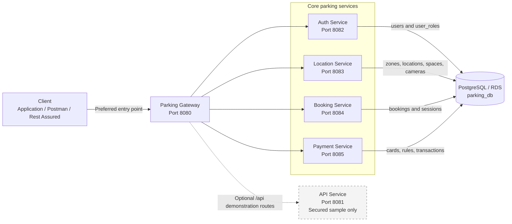
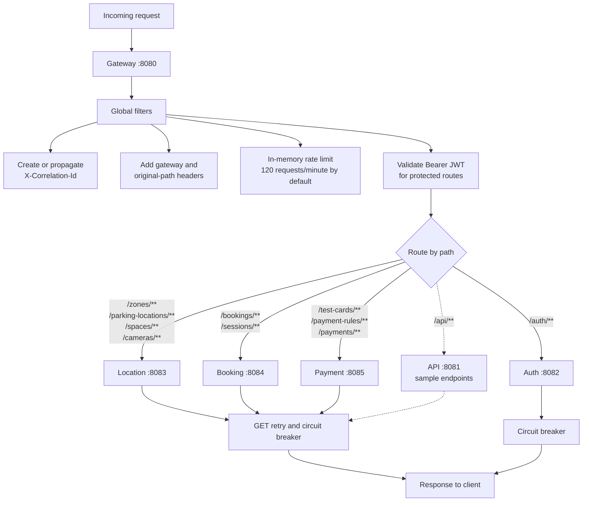
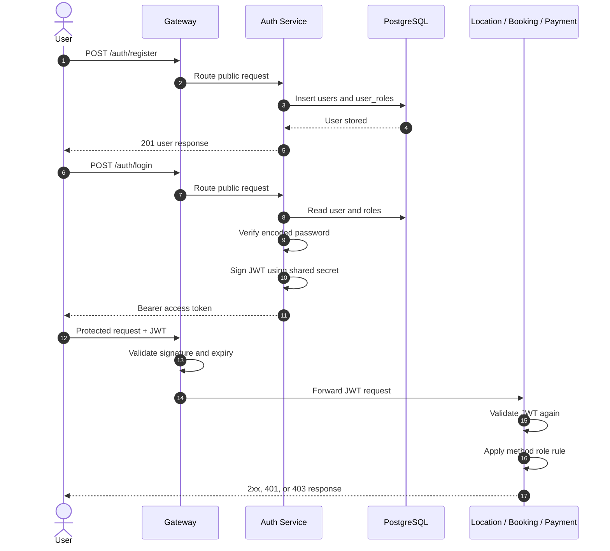
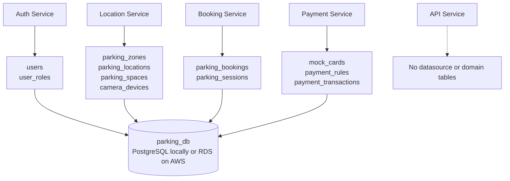
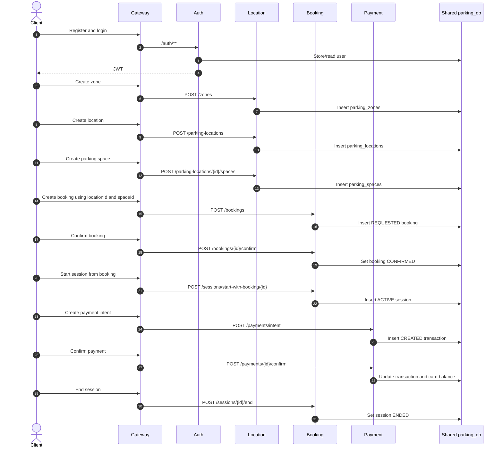
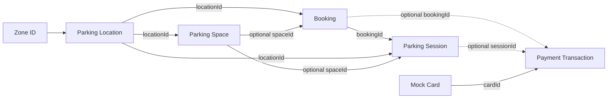
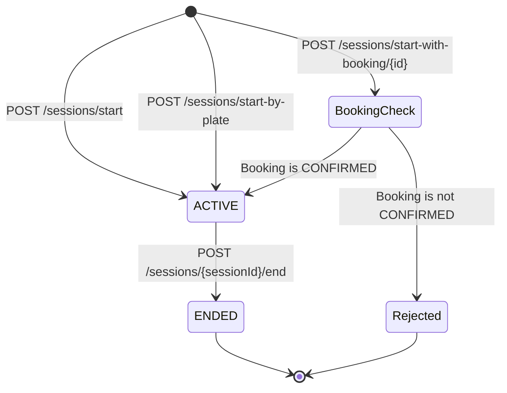
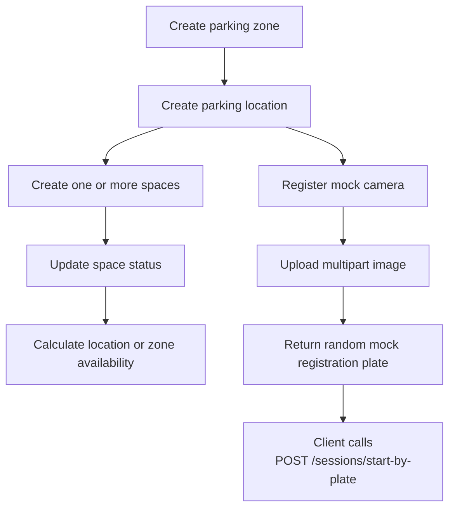
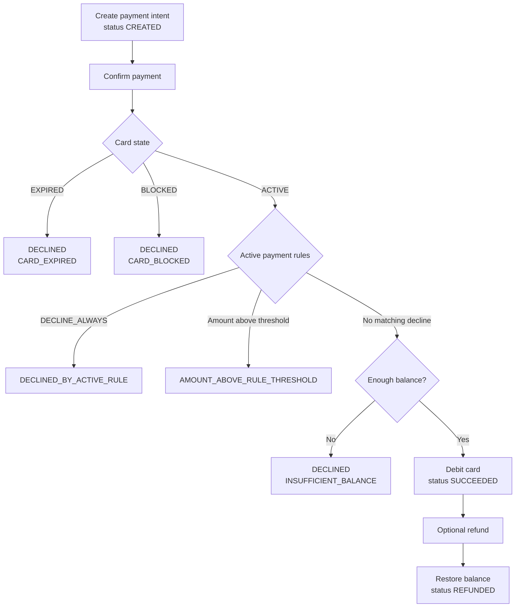
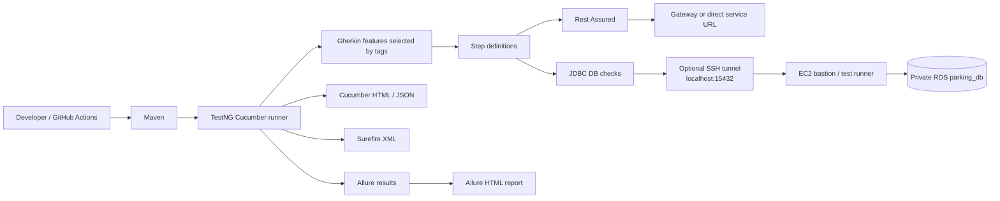

# Parking Microservices Architecture

This document describes the architecture implemented by the service code under `D:\Project\Parking`.

## Review Conclusion

The `parking-api-service` is deployed and routed by the gateway, but it is not part of the current parking business workflow. It provides only:

- `GET /status` and `GET /api/status`
- `GET /api/secure/sample` and `GET /api/secure/hello`

These endpoints demonstrate status and JWT-protected access. Auth, location, booking, session, and payment operations do not call this service. The diagrams therefore show it as an optional demonstration service rather than a core parking service.

The code also shows these important architectural facts:

- The client or automated test orchestrates the workflow by calling each service.
- The domain services do not make HTTP calls to one another.
- Auth, Location, Booking, and Payment use the same PostgreSQL `parking_db` database.
- Each domain service owns a different group of tables inside that shared database.
- IDs such as `locationId`, `bookingId`, and `sessionId` are passed between APIs, but the services do not currently verify them by calling one another.

## 1. Actual Runtime Architecture

The API service is still a runnable service and gateway route. The dashed connection means it is not used by the core parking journey.

## 2. Gateway Routing

The gateway retries only `GET` requests for selected upstream failure statuses. Circuit-breaker fallback responses are produced when a downstream service is unavailable.

## 3. Authentication and Authorization

The services share the JWT signing secret through environment configuration. They do not call Auth to validate every request; each protected service validates the token locally.

## 4. Shared Database and Table Ownership

This is a shared-database architecture, not a separate database per microservice. The service code separates table responsibilities, but all four stateful services connect to the same configured database.

## 5. Current Business Workflow

Notice that Location does not call Booking, and Booking does not call Payment. The client carries resource IDs from one API response into later requests.

## 6. Logical Cross-Service References

These are logical references passed as numeric IDs. Except for relationships inside an individual service's table group, the current migrations do not define database foreign keys between the Location, Booking, and Payment table groups.

## 7. Parking Session Lifecycle

Session query endpoints are:

- `GET /sessions/active`
- `GET /sessions/by-vehicle/{registrationNumber}`

The domain enum also contains `CANCELLED`, but the current controller does not expose a session-cancellation endpoint.

## 8. Location and Camera Flow

The camera endpoint does not call the Booking service. It returns a mock plate to the client, which must then start the session in a separate request.

## 9. Payment Decision Flow

The Payment service uses mock cards and rules intended for deterministic QA testing. It does not integrate with a real payment provider.

## 10. Automated Testing Architecture

For local database verification against private RDS, `localhost:15432` is the local end of the SSH tunnel. Traffic is forwarded through EC2 to RDS; PostgreSQL is not running on the tester's computer.

## 11. Service Classification

| Service | Port | Classification | Current responsibility |
| --- | ---: | --- | --- |
| Gateway | 8080 | Core infrastructure | Routing, JWT enforcement, headers, rate limiting, retries, circuit breakers, and fallback |
| Auth | 8082 | Core business support | User registration, roles, login, and JWT generation |
| Location | 8083 | Core domain | Zones, locations, spaces, availability, cameras, and mock plate events |
| Booking | 8084 | Core domain | Future bookings and actual parking sessions |
| Payment | 8085 | Core domain | Mock cards, test rules, payment intents, confirmation, decline, and refund |
| API | 8081 | Optional demonstration | Status and secured sample endpoints; not used by the parking workflow |

## 12. Important QA Implications

- Test the API service independently as a JWT/security sample, but do not include it as a required step in the parking end-to-end flow.
- Test the gateway and each downstream service because JWT validation occurs at both layers.
- Verify records in the shared `parking_db`, using the table group owned by the service under test.
- Test invalid cross-service IDs because the services do not currently call one another to verify every reference.
- Test cross-user access to bookings, sessions, and payments because ID-based operations require careful ownership controls.
- Test repeated confirm, cancel, end-session, payment-confirm, and refund requests because state transitions are handled inside individual controllers.
- For camera tests, assert plate format and response source rather than expecting the uploaded image to be genuinely recognized.
