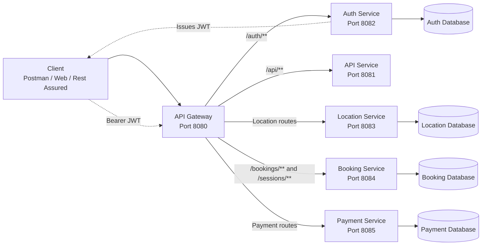
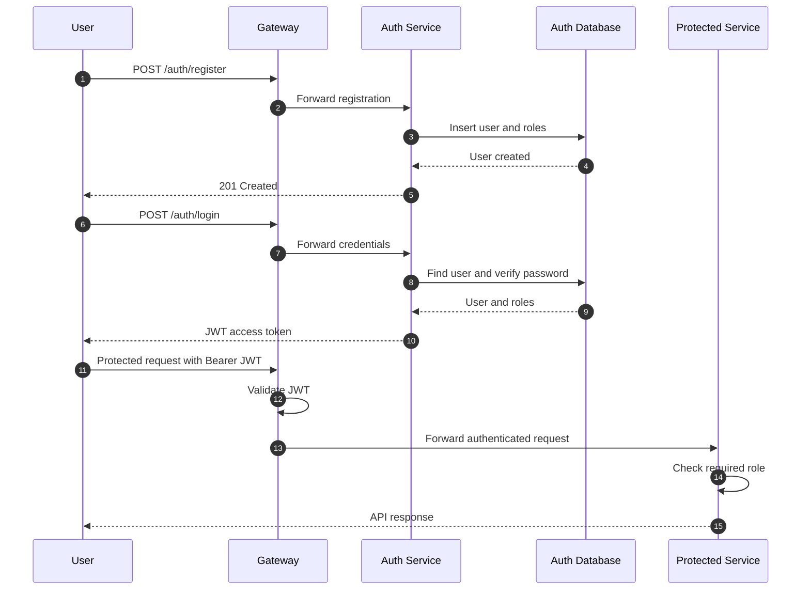
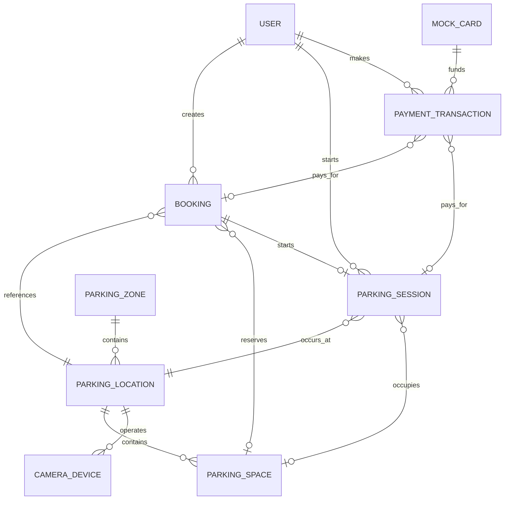
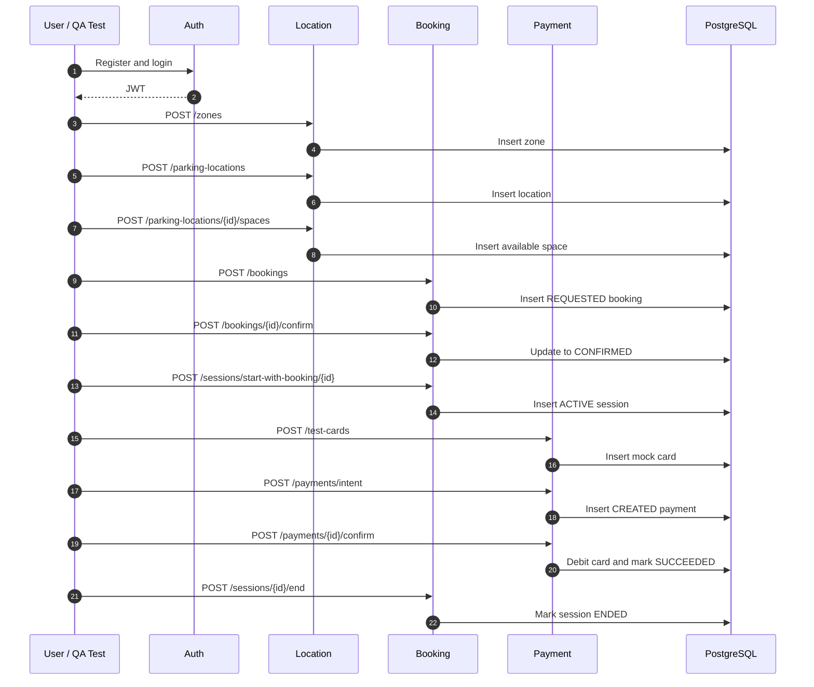
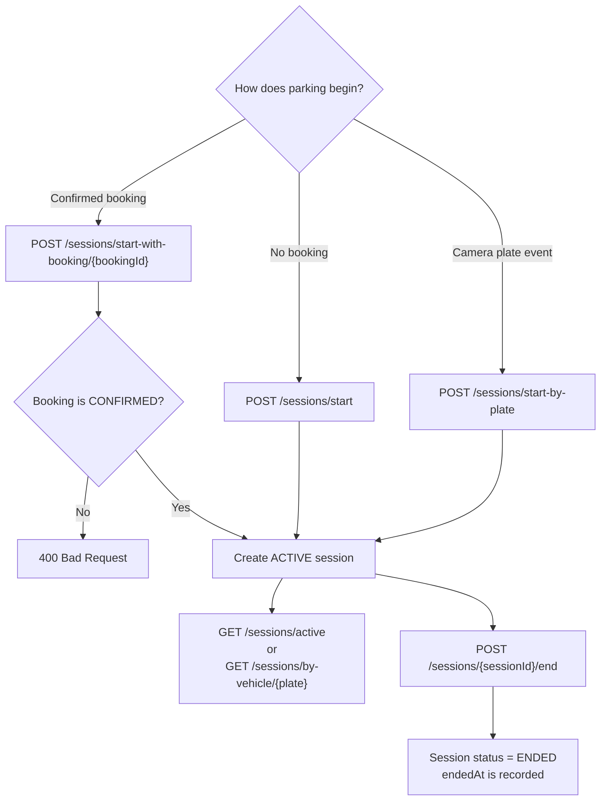
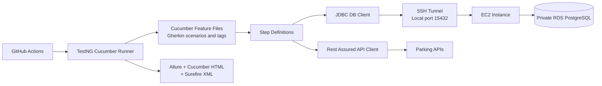

# Parking Microservices Architecture

This document explains the Parking Platform architecture based on the developer services in `D:\Project\Parking`.

## 1. Platform Architecture

The gateway is the preferred API entry point. It validates JWTs, adds or propagates correlation IDs, applies rate limiting, and routes requests to the correct service.

## 2. Authentication Flow

There are two authorization levels:

- The gateway confirms that the JWT is valid.
- The target service checks whether the user has the required role.

## 3. Parking Domain Structure

A booking and a parking session are different:

- A **booking** reserves parking for a future period.
- A **parking session** represents actual parking activity.
- A session can start without a booking, from a confirmed booking, or from a mock camera plate event.

## 4. Complete Parking Flow

## 5. Parking Session Paths

The booking service provides these parking-session APIs:

- `POST /sessions/start`
- `POST /sessions/start-with-booking/{bookingId}`
- `POST /sessions/start-by-plate`
- `POST /sessions/{sessionId}/end`
- `GET /sessions/active`
- `GET /sessions/by-vehicle/{registrationNumber}`

## 6. Automated Testing Architecture

The automated test execution path is:

1. Cucumber selects scenarios using tags such as `@smoke`, `@regression`, and `@db`.
2. TestNG runs the selected Cucumber scenarios.
3. Step definitions call the APIs through Rest Assured.
4. Database verification steps connect through JDBC.
5. For private RDS access, Maven opens an SSH tunnel through EC2.
6. Allure, Cucumber HTML, and Surefire reports are generated.
7. GitHub Actions runs the test suites and stores or publishes the reports.

## 7. Service Responsibilities

| Service | Port | Main responsibility |
| --- | ---: | --- |
| Gateway | 8080 | Routing, JWT validation, correlation IDs, rate limiting, and fallback responses |
| API | 8081 | Public status and secured example APIs |
| Auth | 8082 | Registration, login, roles, and JWT generation |
| Location | 8083 | Zones, locations, spaces, availability, cameras, and plate events |
| Booking | 8084 | Future bookings and active parking sessions |
| Payment | 8085 | Mock cards, payment rules, payment confirmation, declines, and refunds |

## 8. Important QA Boundaries

The following boundaries should be covered by automated tests:

- Public endpoint success without a JWT.
- `401 Unauthorized` when a protected endpoint is called without a valid JWT.
- `403 Forbidden` when the user has a valid JWT but an insufficient role.
- Successful requests for every allowed role.
- Validation failures for missing, blank, malformed, past-date, and negative values.
- `404 Not Found` behavior for unknown resource IDs.
- Booking and session state transitions.
- Payment success, decline, and refund behavior.
- API response verification against inserted or updated database records.
- Gateway routing, correlation ID, fallback, and rate-limit behavior.
